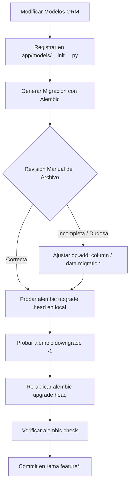

# Guía de Buenas Prácticas, Obligaciones y Estándares para Bases de Datos y Alembic (.agents)

Este documento establece los estándares de ingeniería de software, diseño relacional, modelado con SQLAlchemy 2.0 y gestión del ciclo de vida de migraciones con Alembic para el repositorio **`BackendTallerNarbus`**.

---

## 1. Principios Fundamentales del Diseño de Modelos

### 1.1 Enfoque "Modelo-Primero" (Code-First)
- **Fuente única de verdad:** Los modelos ORM definidos en Python/SQLAlchemy representan el diseño canónico del esquema de base de datos.
- **Sincronización declarativa:** Ningún cambio de esquema debe realizarse manualmente de forma directa en el motor de base de datos. Toda alteración estructural nace en los modelos y se traslada a la base de datos exclusivamente mediante migraciones versionadas de Alembic.

### 1.2 Convenciones de Nomenclatura Estándar

| Elemento | Convención | Formato | Ejemplo en BackendTallerNarbus |
|---|---|---|---|
| **Tablas** | Plural, minúsculas, snake_case | `snake_case` | `buses`, `taller_solicitudes`, `reportes_neumaticos` |
| **Columnas** | Singular, minúsculas, snake_case | `snake_case` | `patente`, `fecha_ingreso`, `estado_solicitud` |
| **Claves primarias** | Singular, identificador numérico o UUID | `id` | `id: Mapped[int] = mapped_column(primary_key=True)` |
| **Claves foráneas** | Singular con prefijo de tabla o concepto referenciado | `<tabla_singular>_id` | `bus_id`, `usuario_solicitante_id`, `categoria_id` |
| **Índices** | Prefijo `ix_` + tabla + columna(s) | `ix_<table>_<column>` | `ix_buses_patente`, `ix_taller_solicitudes_bus_id` |
| **Restricciones Únicas** | Prefijo `uq_` + tabla + columna(s) | `uq_<table>_<column>` | `uq_buses_n_bus`, `uq_usuarios_rut` |
| **Restricciones Check** | Prefijo `ck_` + tabla + condición | `ck_<table>_<condicion>` | `ck_neumaticos_presion_positiva` |
| **Claves Foráneas (Constraint)** | Prefijo `fk_` + origen + destino | `fk_<origen>_<destino>` | `fk_solicitudes_bus_id_buses` |

---

## 2. Modelado con SQLAlchemy 2.0 y Buenas Prácticas

### ✅ OBLIGATORIO (DOs)
1. **Utilizar sintaxis moderna de SQLAlchemy 2.0 (`Mapped` y `mapped_column`):**  
   Declarar los atributos de entidad tipados explícitamente mediante `Mapped[T]` y `mapped_column()`.  
   *Por qué:* Mejora el autocompletado del IDE, habilita el análisis estático de tipos con Mypy/Pyright y previene inconsistencias de tipos en tiempo de compilación/ejecución.
   ```python
   from typing import Optional
   from decimal import Decimal
   from sqlalchemy import String, Numeric, Boolean, Integer, ForeignKey
   from sqlalchemy.orm import Mapped, mapped_column, relationship
   from app.core.base import Base, TimestampMixin

   class RepuestoTaller(Base, TimestampMixin):
       __tablename__ = "repuestos_taller"

       id: Mapped[int] = mapped_column(Integer, primary_key=True, autoincrement=True)
       codigo: Mapped[str] = mapped_column(String(50), unique=True, index=True, nullable=False)
       nombre: Mapped[str] = mapped_column(String(150), nullable=False)
       precio_unitario: Mapped[Decimal] = mapped_column(Numeric(12, 2), nullable=False)
       stock_actual: Mapped[int] = mapped_column(Integer, default=0, nullable=False)
       is_active: Mapped[bool] = mapped_column(Boolean, default=True, nullable=False)
       
       categoria_id: Mapped[Optional[int]] = mapped_column(ForeignKey("categorias_repuesto.id"), nullable=True, index=True)
       categoria: Mapped[Optional["CategoriaRepuesto"]] = relationship("CategoriaRepuesto", back_populates="repuestos")
   ```

2. **Heredar de `TimestampMixin` para auditoría temporal:**  
   Toda tabla operacional de negocio debe heredar de `TimestampMixin` (`created_at` y `updated_at`).  
   *Por qué:* Garantiza trazabilidad temporal exacta del ciclo de vida de los registros sin duplicar definiciones de columnas.

3. **Usar tipos numéricos exactos (`Numeric` / `Decimal`) para finanzas y mediciones:**  
   Nunca usar `Float` para costos, presupuestos, kilometrajes o dimensiones críticas.  
   *Por qué:* Los números de punto flotante introducen errores de redondeo binario acumulativos inaceptables en cálculos comerciales y contables.

4. **Definir longitudes máximas en tipos alfanuméricos (`String(n)`):**  
   Establecer siempre un límite adecuado al dominio (ej. `String(20)` para patentes, `String(100)` para nombres, `Text` para comentarios largos).  
   *Por qué:* Previene el almacenamiento de cargas masivas no controladas y optimiza el uso de memoria en el motor relacional.

5. **Distinguir semánticamente entre `server_default` y `default`:**  
   - Usar `server_default=func.now()` o `server_default="0"` para valores predeterminados evaluados por el motor SQL en inserciones masivas o scripts externos.
   - Usar `default=...` para valores predeterminados controlados por la sesión del ORM en Python.  
   *Por qué:* Los defaults a nivel de servidor aseguran la integridad incluso si se ejecutan queries SQL fuera del ORM.

6. **Definir relaciones bidireccionales explícitas con `back_populates`:**  
   Vincular ambos lados de la relación utilizando `back_populates` y nombres de modelos consistentes.  
   *Por qué:* Asegura la coherencia bidireccional en memoria dentro de la misma sesión SQLAlchemy y previene desincronizaciones de estado.

7. **Indexar de forma deliberada claves foráneas y columnas de filtro frecuente:**  
   Toda columna que participe habitualmente en cláusulas `WHERE`, `JOIN` o `ORDER BY` debe contar con `index=True` o índices compuestos en `__table_args__`.  
   *Por qué:* Elimina escaneos secuenciales masivos (*Sequential Scan*) en tablas con miles de registros operacionales.

### ❌ PROHIBIDO (DON'Ts)
1. **NUNCA usar tipos de datos genéricos ambiguos sin longitud (evitar `Column(String)` sin especificar tamaño).**  
   *Por qué:* En muchos motores relacionales esto se traduce en campos `TEXT` ilimitados sin restricciones de tamaño a nivel de base de datos.
2. **NUNCA omitir la nulabilidad explícita (`nullable=False` o `nullable=True`).**  
   *Por qué:* Los campos que no definen `nullable` asumen `True` por defecto, permitiendo que registros incompletos o corruptos violen las reglas de negocio silenciosamente.
3. **NUNCA usar `cascade="all, delete-orphan"` a la ligera en entidades maestras o catálogos compartidos.**  
   *Por qué:* Podría provocar la eliminación en cascada accidental de registros históricos críticos (ej. eliminar un bus y borrar todas sus solicitudes históricas de taller).

---

## 3. Gestión y Flujo de Migraciones con Alembic

### 3.1 Configuración Profesional del Entorno (`alembic/env.py`)
Alembic debe estar configurado para detectar cambios sutiles pero críticos entre los modelos y la base de datos:
- `compare_type=True`: Permite detectar cambios en longitudes de `String` o cambios de tipos (`Integer` a `BigInteger`).
- `compare_server_default=True`: Detecta alteraciones en valores por defecto a nivel de base de datos.
- **Importación centralizada:** Todos los modelos deben registrarse en `app/models/__init__.py` para que `Base.metadata` contenga el 100% de los esquemas.

```python
# alembic/env.py
def do_run_migrations(connection: Connection) -> None:
    context.configure(
        connection=connection,
        target_metadata=target_metadata,
        compare_type=True,
        compare_server_default=True,
    )
    with context.begin_transaction():
        context.run_migrations()
```

### 3.2 Flujo de Trabajo Obligatorio para Migraciones
El desarrollo de cualquier migración debe seguir rigurosamente los siguientes pasos:



1. **Generar la migración automáticamente:**  
   `alembic revision --autogenerate -m "descripcion_clara_del_cambio"`
2. **Revisión manual OBLIGATORIA:**  
   Inspeccionar el script generado en `alembic/versions/`. Alembic no detecta renombrado de columnas automáticamente (suele generar un `drop_column` y un `add_column`, lo que causaría pérdida de datos).
3. **Prueba de ciclo completo local:**  
   - Ejecutar `alembic upgrade head`.
   - Ejecutar `alembic downgrade -1` para garantizar reversibilidad.
   - Re-aplicar `alembic upgrade head`.
4. **Verificación de concordancia:**  
   Ejecutar `alembic check` para verificar que no queden diferencias pendientes entre el código y la base de datos.

---

## 4. Estrategias de Migración por Tipo de Cambio y Mitigación de Riesgos

| Tipo de Cambio | Nivel de Riesgo | Estrategia Recomendada | Comandos y Operaciones |
|---|---|---|---|
| **Nueva tabla** | Bajo | Creación directa en `upgrade()` y borrado en `downgrade()`. | `op.create_table(...)` |
| **Nuevo campo opcional (`nullable=True`)** | Bajo | Incorporación directa mediante `op.add_column()`. | `op.add_column('tabla', sa.Column(...))` |
| **Nuevo campo requerido (`nullable=False`)** | **Medio / Alto** | **Estrategia Progresiva en 3 fases:**<br>1. Agregar columna como `nullable=True`<br>2. Poblar datos por defecto (`op.execute("UPDATE...")`)<br>3. Alterar columna a `nullable=False`. | `op.add_column(...)`<br>`op.execute(...)`<br>`op.alter_column(..., nullable=False)` |
| **Renombrar columna** | **Alto** | No permitir drop/add. Usar `op.alter_column(..., new_column_name=...)` para conservar datos. | `op.alter_column('t', 'viejo', new_column_name='nuevo')` |
| **Eliminar columna** | **Alto** | 1. Marcar como obsoleta en modelos y retirar lecturas del código.<br>2. En una migración posterior, ejecutar `op.drop_column()`. | `op.drop_column('tabla', 'columna')` |
| **Modificar tipo de dato compatible** | **Muy Alto** | Usar conversión explícita o columna temporal intermedia si hay datos existentes. | `op.alter_column(..., type_=sa.BigInteger, postgresql_using='columna::bigint')` |

### Ejemplo: Migración Segura para Campo Requerido en Tabla Existente

```python
"""Agregar campo prioridad_nivel NOT NULL a taller_solicitudes

Revision ID: 8f9b2a1c4e7d
Revises: 7a1b2c3d4e5f
Create Date: 2026-09-14 11:00:00.000000
"""
from alembic import op
import sqlalchemy as sa

revision = '8f9b2a1c4e7d'
down_revision = '7a1b2c3d4e5f'
branch_labels = None
depends_on = None

def upgrade() -> None:
    # Paso 1: Agregar columna permitiendo nulos temporalmente
    op.add_column('taller_solicitudes', sa.Column('prioridad_nivel', sa.Integer(), nullable=True))
    
    # Paso 2: Poblar registros existentes con valor por defecto coherente
    op.execute("UPDATE taller_solicitudes SET prioridad_nivel = 1 WHERE prioridad_nivel IS NULL")
    
    # Paso 3: Aplicar restricción NOT NULL definitiva
    op.alter_column('taller_solicitudes', 'prioridad_nivel', nullable=False)

def downgrade() -> None:
    op.drop_column('taller_solicitudes', 'prioridad_nivel')
```

---

## 5. Control de Concurrencia y Bloqueos en Base de Datos

### ✅ OBLIGATORIO (DOs)
1. **Minimizar el tiempo de transacciones DDL:**  
   Toda sentencia que adquiera bloqueos exclusivos de tabla (`ACCESS EXCLUSIVE`) debe ejecutarse en transacciones cortas.  
   *Por qué:* Evita encolar peticiones de la API y causar *timeouts* o caídas del servicio en producción.
2. **Crear índices de forma concurrente en tablas masivas si el motor lo soporta:**  
   En PostgreSQL sobre tablas con alto volumen operacional, evaluar índices concurrentes fuera de transacciones DDL bloqueantes si el entorno lo requiere.
3. **Descomponer migraciones complejas en pasos pequeños e independientes:**  
   Si se requiere una reestructuración de esquema con migración de miles de filas, dividirla en múltiples revisiones consecutivas.  
   *Por qué:* Reduce drásticamente la probabilidad de colisiones, facilita la reversión y aísla posibles fallos.

### ❌ PROHIBIDO (DON'Ts)
1. **NUNCA ejecutar `op.drop_table()` o `op.drop_column()` sin verificar que ningún servicio o DTO siga consultando la entidad.**  
   *Por qué:* Provoca errores inmediatos de tipo `UndefinedColumn` o `UndefinedTable` en las peticiones entrantes concurrentes.
2. **NUNCA dejar funciones de `downgrade()` vacías (`pass`).**  
   *Por qué:* Impide revertir despliegues defectuosos mediante `alembic downgrade`, dejando la base de datos atascada en un estado irremediable.

---

## 6. Resolución de Problemas y Errores Frecuentes

### 6.1 Conflicto de Ramas en Git (Multiple Heads)
- **Síntoma:** Al ejecutar `alembic upgrade head`, Alembic emite el error: `Multiple head revisions are present for given argument 'head'`.
- **Causa:** Dos ramas `feature/*` generaron migraciones independientes partiendo de la misma revisión base.
- **Solución estándar:**  
  1. Identificar las revisiones en conflicto: `alembic heads`.
  2. Generar una migración de unión: `alembic merge -m "merge_ramas_conflicto" <rev1> <rev2>`.
  3. Probar `alembic upgrade head`.

### 6.2 Desincronización de Base de Datos y Código
- **Síntoma:** `alembic check` reporta diferencias no migradas o `alembic upgrade` intenta crear tablas que ya existen físicamente.
- **Prevención:**  
  - NUNCA crear tablas manualmente con clientes SQL externos (pgAdmin, DBeaver) sin registrar la migración correspondiente.
  - Solo en caso de restauración manual de esquemas en entornos locales de desarrollo, usar `alembic stamp <revision_id>` para alinear el puntero de versión sin re-ejecutar el DDL.

---

## 7. Checklist Pre-Despliegue de Base de Datos

Antes de realizar merge a la rama `develop` y antes de promover a entornos de producción, se debe verificar la siguiente lista:

- [ ] **Modelo registrado:** El modelo SQLAlchemy está importado y exportado en `app/models/__init__.py`.
- [ ] **Revisión manual completada:** El script de migración en `alembic/versions/` no contiene operaciones destructivas inesperadas (`drop_table` o `drop_column` accidentales).
- [ ] **Reversibilidad probada:** Se ejecutó `alembic upgrade head` y `alembic downgrade -1` exitosamente en el entorno local.
- [ ] **Diferencias en cero:** `alembic check` se ejecuta sin reportar discrepancias pendientes.
- [ ] **Migración de datos segura:** Si se agregaron columnas `NOT NULL`, se aplicó la estrategia progresiva con valor por defecto.
- [ ] **DTOs y Repositorios alineados:** Los esquemas Pydantic y consultas de SQLAlchemy reflejan fielmente los nuevos campos.
- [ ] **Sin DDL en runtime:** No existen llamadas a `create_all()`, `drop_all()` ni sentencias DDL dentro del código de FastAPI o tareas en segundo plano.
