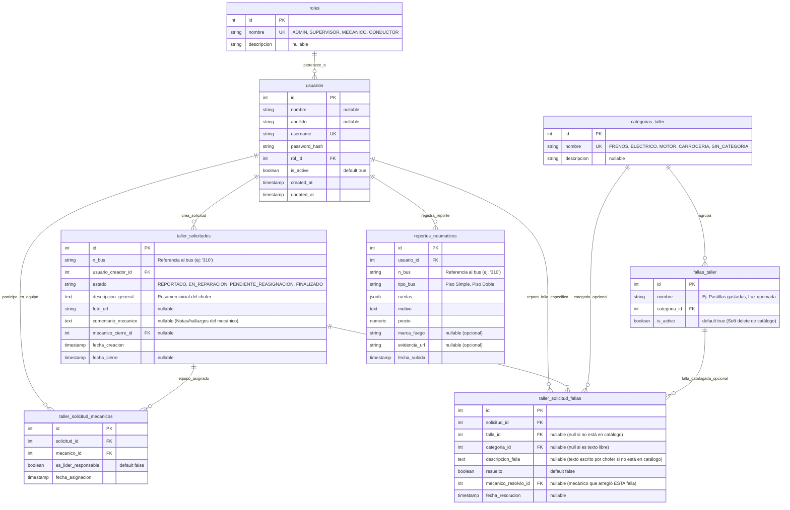

# 🚀 Plan de Implementación Final: Sistema Taller & Neumáticos Narbus

Este documento define la especificación técnica completa y la arquitectura modular para el backend y frontend del sistema independiente de **Taller y Neumáticos Narbus**.

---

## 💡 Resumen de Nomenclatura y Aclaraciones Técnicas

> [!NOTE]
> 1. **Cambio de Nomenclatura: De 'Items' a 'Fallas'**:
>    - Se renombra `items_taller` $\rightarrow$ **`fallas_taller`** (Catálogo de fallas predefinidas).
>    - Se renombra `taller_solicitud_detalles` $\rightarrow$ **`taller_solicitud_fallas`** (Fallas reportadas en la solicitud).
> 2. **¿Dónde se guarda la descripción de la falla?**:
>    - **Falla de Catálogo**: Si el chofer la selecciona de la lista, la descripción proviene del nombre en `fallas_taller` (vía `falla_id FK`).
>    - **Falla Personalizada**: Si el chofer escribe una falla que no está en el catálogo, se guarda en el campo **`descripcion_falla`** con `falla_id = NULL` y `categoria_id = NULL`.
> 3. **¿Por qué `is_active` en `fallas_taller`?**:
>    - Permite deshabilitar (`is_active = False`) fallas obsoletas o en desuso del catálogo para que no aparezcan en nuevos formularios, **sin borrar el historial** de solicitudes pasadas.

---

## 🎯 1. Arquitectura y Reglas del Negocio

1. **Base de Datos Dedicada (`narbus_taller_db`)**:
   - Operación totalmente aislada del sistema central.
   - Manejo de migración y esquema propio con SQLAlchemy y Alembic.
2. **Normalización de Roles y Usuarios**:
   - Tabla `roles`: `ADMIN`, `SUPERVISOR`, `MECANICO`, `CONDUCTOR`.
   - Tabla `usuarios`: `id`, `nombre`, `apellido`, `username`, `password_hash`, `rol_id`, `is_active`.
3. **Catálogo de Fallas de Taller (`categorias_taller` y `fallas_taller`)**:
   - **`categorias_taller`**: Categorías (*Frenos, Eléctrico, Motor, Carrocería, Sin Categoría*).
   - **`fallas_taller`**: Fallas predefinidas asociadas a `categoria_id FK`. Posee `is_active` para activar/desactivar opciones.
4. **Módulo de Mantención de Taller (`app/modules/mantencion`)**:
   - **`taller_solicitudes`**: Cabecera de solicitud con `comentario_mecanico`.
   - **`taller_solicitud_mecanicos`**: Registro del equipo de mecánicos asignados.
   - **`taller_solicitud_fallas`**: Cada falla reportada por el bus (catalogada o texto libre en `descripcion_falla`). Registra qué mecánico solucionó cada falla específica (`mecanico_resolvio_id FK`).
5. **Módulo Independiente de Neumáticos (`app/modules/neumaticos`)**:
   - Inspección de neumáticos (`reportes_neumaticos`) independiente del taller, `marca_fuego` opcional.

---

## 🗄️ 2. Modelo Relacional de Base de Datos

---

## 🏗️ 3. Modificaciones Propuestas por Componente

### Backend (`BackendTallerNarbus`)

#### [NEW] [fallas_taller.py](file:///c:/Users/Fabian/Desktop/Narbus/BackendTallerNarbus/app/modules/mantencion/models/fallas_taller.py)
- Crear el modelo ORM `FallaTaller` con `id`, `nombre`, `categoria_id FK` e `is_active` (boolean).

#### [NEW] [taller_solicitud_falla.py](file:///c:/Users/Fabian/Desktop/Narbus/BackendTallerNarbus/app/modules/mantencion/models/taller_solicitud_falla.py)
- Modelo ORM mapeado a `taller_solicitud_fallas` con `solicitud_id FK`, `falla_id FK`, `descripcion_falla` (texto libre), `resuelto`, `mecanico_resolvio_id FK` y `fecha_resolucion`.

#### [MODIFY] [taller_solicitud.py](file:///c:/Users/Fabian/Desktop/Narbus/BackendTallerNarbus/app/modules/mantencion/models/taller_solicitud.py)
- Incluir `comentario_mecanico: Mapped[Optional[str]] = mapped_column(Text, nullable=True)`.

---

## 🧪 4. Plan de Verificación

### Pruebas de Integración y API
1. **Prueba de Fallas de Catálogo vs Fallas Personalizadas**:
   - Crear solicitud con Falla 1 seleccionada de catálogo (`falla_id = 5`) y Falla 2 personalizada (`falla_id = NULL`, `descripcion_falla = "Ruido extraño en caja de cambios"`).
   - Comprobar inserción en `taller_solicitud_fallas`.
2. **Prueba de `is_active` en `fallas_taller`**:
   - Cambiar `is_active = False` a una falla del catálogo y comprobar que ya no se muestra en el endpoint de fallas activas para nuevos reportes, manteniendo intactos los reportes pasados.
